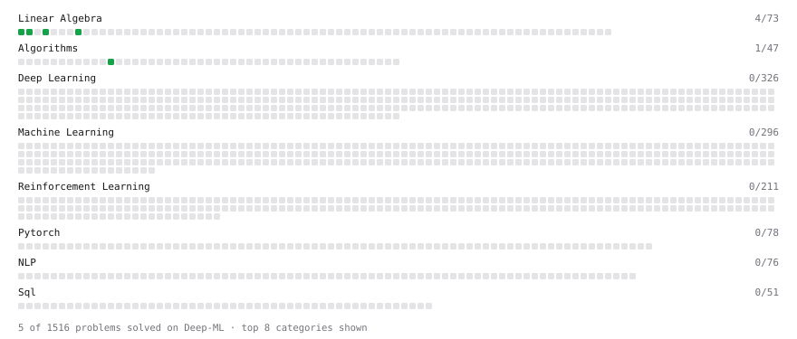

# Deep-ML

My machine learning practice from [Deep-ML](https://www.deep-ml.com). Every solution here was written by hand.

**8** solved · 8 problems · 0 labs · 0 math

[**Browse the interactive portfolio**](https://abhishekyadav-01n.github.io/deep-ml/) to replay this filling in over time.

## Problems

| | Difficulty | Solved | |
| --- | --- | --- | --- |
| [Calculate 2x2 Matrix Inverse](https://www.deep-ml.com/problems/8) | easy | 2026-10-05 | [solution](problems/0008-calculate-2x2-matrix-inverse) |
| [Calculate Mean by Row or Column](https://www.deep-ml.com/problems/4) | easy | 2026-10-03 | [solution](problems/0004-calculate-mean-by-row-or-column) |
| [Matrix-Vector Dot Product](https://www.deep-ml.com/problems/1) | easy | 2026-10-03 | [solution](problems/0001-matrix-vector-dot-product) |
| [One-Hot Encoding of Nominal Values](https://www.deep-ml.com/problems/34) | easy | 2026-10-05 | [solution](problems/0034-one-hot-encoding-of-nominal-values) |
| [Sigmoid Activation Function Understanding](https://www.deep-ml.com/problems/22) | easy | 2026-10-05 | [solution](problems/0022-sigmoid-activation-function-understanding) |
| [Softmax Activation Function Implementation ](https://www.deep-ml.com/problems/23) | easy | 2026-10-05 | [solution](problems/0023-softmax-activation-function-implementation) |
| [Top-K Largest Elements in a List](https://www.deep-ml.com/problems/1137) | easy | 2026-10-02 | [solution](problems/1137-top-k-largest-elements-in-a-list) |
| [Transpose of a Matrix](https://www.deep-ml.com/problems/2) | easy | 2026-10-03 | [solution](problems/0002-transpose-of-a-matrix) |

---

_This file is regenerated by Deep-ML on every push._
